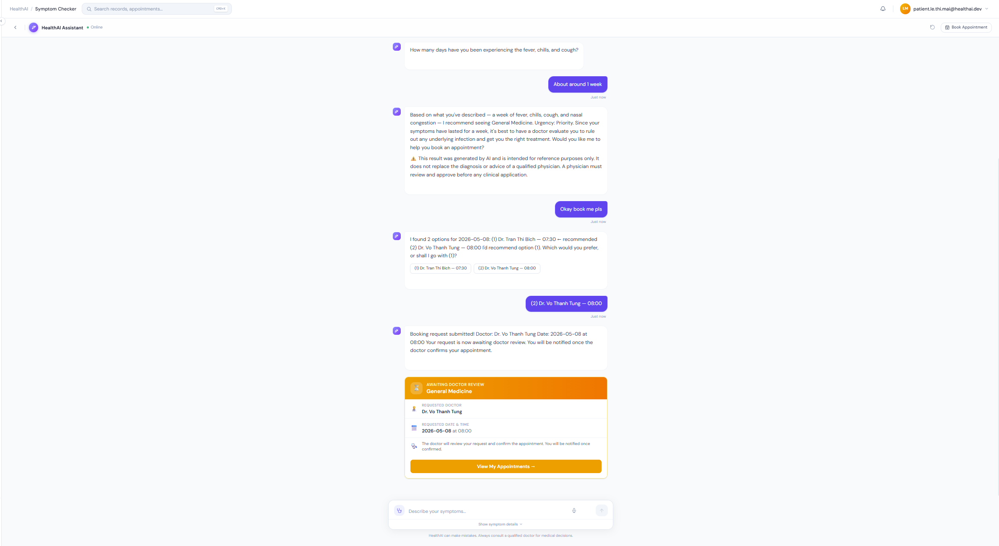
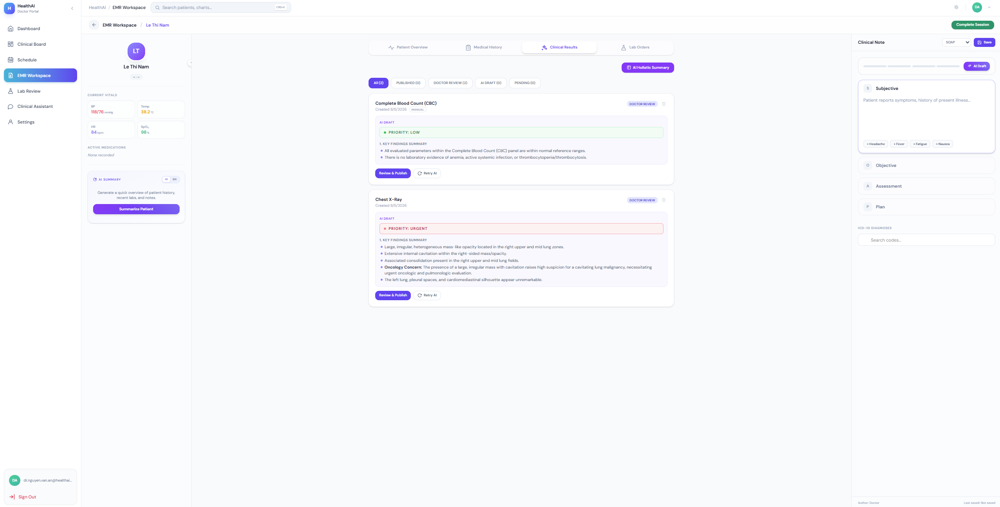
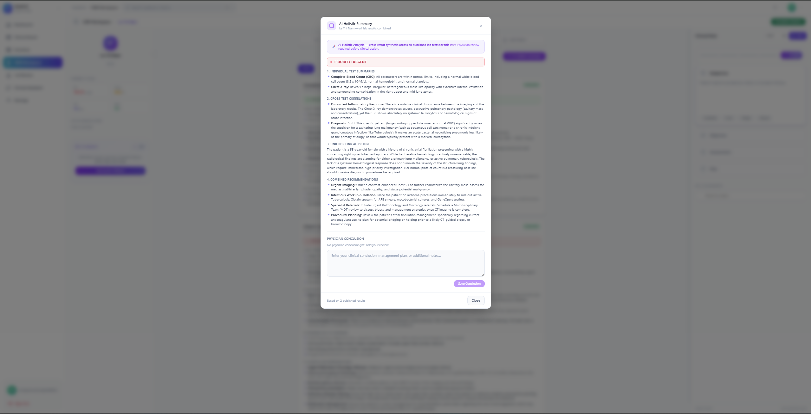

<div align="center">
  <h1>🏥 HealthAI Clinical OS (Frontend)</h1>
  <p><i>A Next-Generation Role-Based Healthcare Portal</i></p>
</div>

<br />

## 📖 About The Project

HealthAI Portal is a modern, single-page application (SPA) designed to bridge the gap between patients and healthcare providers. Built with **React 19** and **Vite**, it delivers a blazing-fast, responsive, and deeply integrated experience.

Originally conceived as a frontend prototype, this repository now serves as the **main presentation layer** for the HealthAI Microservices ecosystem, integrating seamlessly via our Kong API Gateway.

## ✨ Key Features

### 🧑‍⚕️ For Doctors (Clinical Workspace)
*   **Smart Queue Management:** Real-time patient queue with lab readiness indicators.
*   **AI-Powered Clinical Assist:** Ask questions and get differential diagnoses backed by RAG and clinical guidelines.
*   **HITL Lab Review:** Human-in-the-loop workflow for reviewing AI-drafted lab results.
*   **Automated EMR Summaries:** Streaming SSE summaries of patient history before consultations.

### 🤒 For Patients (Health Portal)
*   **Intelligent Triage:** AI Symptom Checker that conducts dynamic interviews and recommends the right medical specialty.
*   **Seamless Booking:** Real-time slot booking with integrated VNPAY payment gateway.
*   **Digital Health Records:** Secure access to clinical summaries, prescriptions, and lab results.
*   **Smart Notifications:** Real-time WebSocket updates for appointment status and lab results.

## 🛠 Tech Stack

*   **Core:** React 19, Vite 8
*   **Styling:** Tailwind CSS (Custom utility classes for pristine UI)
*   **State Management & Data Fetching:** React Hooks, Async/Await
*   **Code Quality:** ESLint, PropTypes

---

## 📸 System Interfaces

### Patient Portal
<div align="center">
  
  <br/>
  <em>Secure Role-Based Authentication</em>
</div>
<br/>
<div align="center">
  
  <br/>
  <em>AI Symptom Checker & Triage</em>
</div>
<br/>
<div align="center">
  
  <br/>
  <em>Real-time Appointment Booking</em>
</div>

### Clinical & Administrative Interfaces
*(Latest System Updates)*
<div align="center">
  
</div>
<br/>
<div align="center">
  
</div>
<br/>
<div align="center">
  
</div>

---

## 🚀 Getting Started

### 1. Installation

```bash
# Clone the repository and install dependencies
npm install
```

### 2. Local Development

```bash
npm run dev
# The app will be available at http://localhost:5173
```

### 3. Production Build

```bash
npm run build
npm run preview
```

## 🔄 Development Workflow

### Branching Strategy
*   `main`: Stable, production-ready code.
*   `develop`: Main integration branch.
*   `feature/*`: Feature development and bug fixes.

### Automated CI/CD
Every push to a `feature/*` branch automatically triggers a GitHub Action to create a Pull Request against the `develop` branch, ensuring a streamlined and peer-reviewed integration process.

## 🧪 Demo Credentials (Local Dev)
If running without the backend gateway, you can use these mocked credentials:
*   **Patient:** `jane.doe@email.com` / `patient123`
*   **Doctor 1:** `dr.chen@healthai.vn` / `doctor123`
*   **Doctor 2:** `dr.reid@healthai.vn` / `doctor123`
