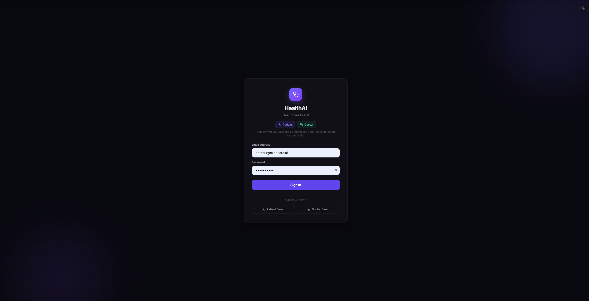
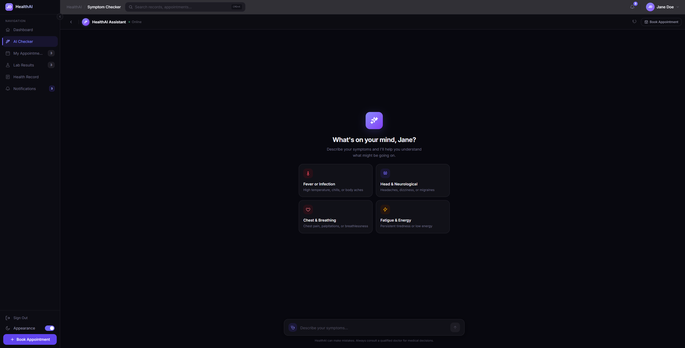
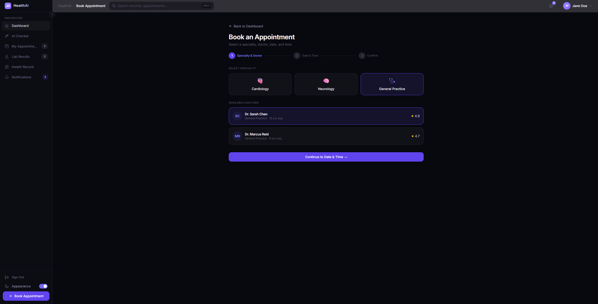

# HealthAI Portal (Frontend Demo)

A role-based healthcare frontend demo built with React + Vite.

This project is currently a frontend-only demo (mock auth + mock data), combining both patient and doctor experiences in a single SPA.

## Overview

- Single entry point and single app root.
- Role-based login flow for patient and doctor.
- Patient portal flows:
	- Dashboard
	- AI Symptom Checker
	- Appointment booking and confirmation
	- Appointment rescheduling flow
	- Lab results and health records
	- Notifications
- Doctor portal flows:
	- Clinical dashboard
	- Patient queue
	- Schedule
	- EMR workspace (placeholder view)
	- Doctor chat (placeholder view)
- Light/dark mode support.

## Tech Stack

- React 19
- Vite 8
- PropTypes
- Tailwind CSS (project styling utilities)
- ESLint

## Getting Started

### 1. Install dependencies

```bash
npm install
```

### 2. Run in development

```bash
npm run dev
```

Default local URL:

```text
http://localhost:5173
```

### 3. Build for production

```bash
npm run build
```

### 4. Preview production build

```bash
npm run preview
```

## Available Scripts

- `npm run dev`: Start dev server.
- `npm run build`: Build production bundle.
- `npm run preview`: Preview production build.
- `npm run lint`: Run ESLint.

## Demo Credentials

These credentials are stored in `src/data/users.js` for demo purposes.

### Patient Demo

- Email: `jane.doe@email.com`
- Password: `patient123`

### Doctor Demo

- Email: `dr.chen@healthai.vn`
- Password: `doctor123`

Alternative doctor account:

- Email: `dr.reid@healthai.vn`
- Password: `doctor123`

## Project Structure

```text
src/
	App.jsx
	data/
		users.js
	views/
		auth/
		patient/
		doctor/
	components/
		shared/
		patient/
		doctor/
```

## Demo Screenshots

### Login Screen



### Patient - AI Checker



### Patient - Appointment Booking



## Notes

- This repository is frontend-only for now.
- Authentication and user data are mocked locally.
- Backend integration can be added in a later phase.
